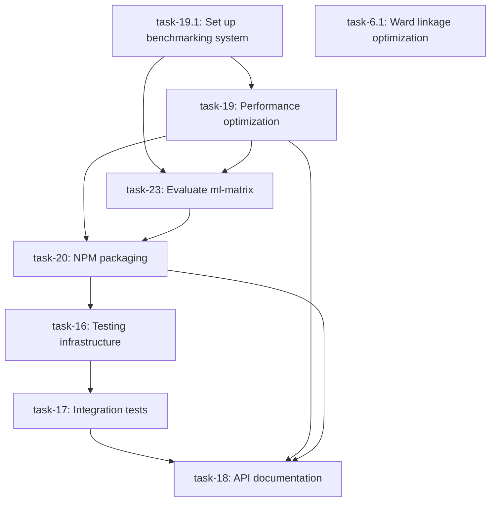

# Task Dependencies and Execution Order

This document outlines the dependencies between remaining tasks and the recommended execution order.

## Dependency Graph

## Execution Order

### Phase 1: Performance Analysis (Foundation)

1. **task-19.1: Set up continuous benchmarking system**
   - Must be done first to measure impact of all optimizations
   - Provides data for backend selection decisions
   - No dependencies

### Phase 2: Optimization and Backend Selection

2. **task-19: Optimize memory usage and performance**
   - Depends on: task-19.1 (need benchmarking to measure improvements)
   - Test all TensorFlow.js backends
   - Identify performance bottlenecks

3. **task-23: Evaluate ml-matrix as fallback backend**
   - Depends on: task-19.1, task-19 (need performance baselines)
   - Decide whether to keep ml-matrix based on benchmarks
   - Critical for packaging decisions

### Phase 3: Packaging

4. **task-20: Package and publish to npm**
   - Depends on: task-19, task-23 (need backend decisions)
   - Implement backend packaging strategy
   - Set up optional peer dependencies

### Phase 4: Testing

5. **task-16: Set up comprehensive testing infrastructure**
   - Depends on: task-20 (need package structure finalized)
   - Jest configuration, test utilities
   - CI/CD pipeline setup

6. **task-17: Create integration tests comparing with scikit-learn**
   - Depends on: task-16 (need testing infrastructure)
   - Validation against sklearn outputs
   - Edge case testing

### Phase 5: Documentation

7. **task-18: Implement API documentation and usage examples**
   - Depends on: task-17, task-19, task-20 (need stable API and performance data)
   - TypeDoc setup
   - Usage examples and migration guides

### Independent Task

8. **task-6.1: Implement Ward linkage algorithm**
   - No dependencies on other tasks
   - Can be done in parallel with other work

## Key Decision Points

1. **After task-19.1**: Benchmark data will inform which backends are worth supporting
2. **After task-23**: Decision on ml-matrix will impact package size and complexity
3. **After task-20**: Package structure will determine testing approach

## Parallelization Opportunities

- task-6.1 can be done anytime (no dependencies)
- Documentation prep (JSDoc comments) can start early
- Test fixture generation can begin before full infrastructure

## Critical Path

The critical path is: 19.1 → 19 → 23 → 20 → 16 → 17 → 18

This represents the longest sequence of dependent tasks that must be completed sequentially.
