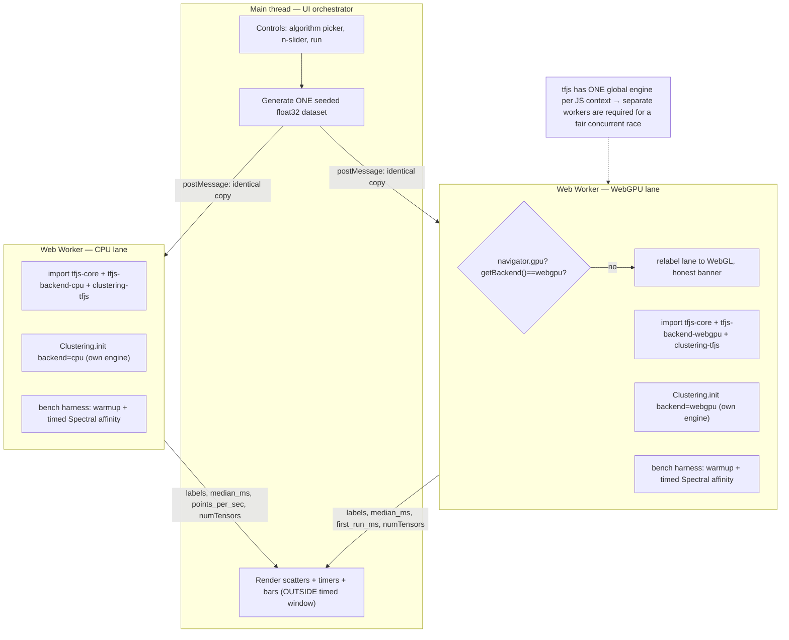
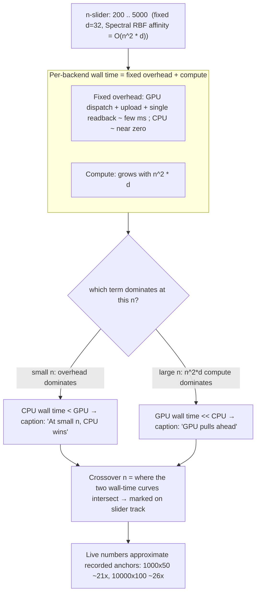
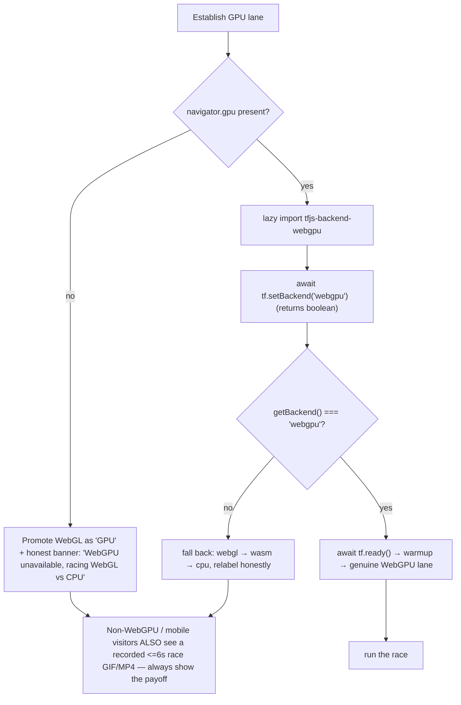
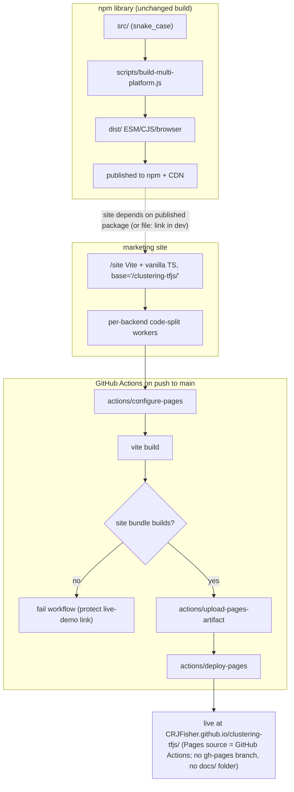

# Interactive clustering demo — design & architecture

A comprehension companion for **task-55**. It explains what the demo is, why it is shaped the way it is, and how the pieces fit together. The system is described as it is intended to be built.

An interactive HTML companion lives alongside this file at `interactive-clustering-demo-design.html` (self-contained, opens offline).

## The one idea

Turn the library's two strongest claims into things a visitor can _see in 30 seconds_, with zero install:

- **Speed** — a live **WebGPU-vs-CPU race** on the same dataset, with honest wall-clock timers and a "GPU is N.Nx faster" headline.
- **Trust** — the iconic **scikit-learn toy-dataset grid** (moons / circles / blobs / anisotropic / no-structure) recreated _live_ across all five algorithms, signaling parity to every data scientist who recognizes that image.

The race makes "GPU-accelerated" visceral and screenshot-worthy; the grid makes "TensorFlow.js wrapper" read as "this is the sklearn clustering I already know."

**The hook, used everywhere:** _"scikit-learn clustering, GPU-accelerated, 100% in your browser — no Python, no install."_

## Who it is for

| Audience | What converts them |
| --- | --- |
| Data scientists who know sklearn | The familiar grid → "parity, in JS, no Python service" |
| JS/TS engineers building in-browser ML | The WebGPU speed hook + copy-paste code panel |
| HN / r/MachineLearning / r/javascript readers | An honest, interactive, zero-install demo |
| Educators & bloggers | distill-style parameter sliders that teach (durable inbound links) |
| Build-vs-buy evaluators | A 30-second proof-of-value + copy-paste quickstart |

## The headline gap that _is_ the feature

WebGPU is **not** wired into the library today — only `cpu`, `webgl`, `wasm`, `tensorflow`. Adding `@tensorflow/tfjs-backend-webgpu` behind a per-backend ESM loader (task-55.1) is the one library change worth making, and it is the centerpiece of the launch. Without WebGPU there is no race.

## The load-bearing constraint: one global engine per context

TensorFlow.js keeps a **single global engine/backend per JS context**. `src/backend/backend.ts` holds a module-level singleton and `Clustering.init` calls `tf.setBackend` once. So WebGPU and CPU **cannot** be active at the same time on the main thread.

A _fair, concurrent_ race therefore **requires one dedicated Web Worker per backend** — each worker is its own JS realm with its own tfjs engine. This is not a preference; it is the only correct design.



## The fairness protocol — honesty as a feature

The demo will face Hacker News scrutiny, so the timing rules are surfaced _in the UI_, not buried. The same harness runs in every worker:

1. **One float32 input**, identical data uploaded to every lane. Never compare a float64 JS path against float32 GPU — the "speedup" would be partly a precision artifact.
2. **2–3 discarded warmups** per backend — absorb WGSL shader compile, wasm instantiation, lazy kernel registration.
3. **Time the full call including the awaited readback** (`await tensor.data()`). Timing only JS dispatch produces a fake ~100× and reads as dishonest.
4. **Exactly one readback boundary** per run, identical across lanes.
5. **≥5 timed reps; report the median** plus min/max, never a single best run.
6. **Dispose between runs; assert `tf.memory().numTensors` returns to baseline** so leaks don't skew results.
7. **First-run (shader-compile) time is disclosed separately**, never folded into the headline multiplier.

```mermaid
sequenceDiagram
    participant UI as UI (main thread)
    participant W as Worker
    participant E as tfjs Engine
    participant D as GPU / CPU device

    UI->>W: run(n, params)
    W->>E: generate + upload ONE float32 input tensor
    loop 2-3 warmup runs (discarded)
        W->>D: Spectral affinity + awaited readback
        Note over W,D: first warmup absorbs WGSL compile / wasm init / kernel registration
    end
    loop >=5 timed runs
        W->>W: t0 = performance.now()
        W->>D: fit / affinity compute
        D-->>W: await tensor.data()  (SINGLE readback)
        W->>W: t1 = performance.now()
        W->>E: tidy / dispose
        W->>E: assert numTensors == baseline
    end
    W->>W: median + min/max ; first_run_ms kept separate
    W-->>UI: {median_ms, first_run_ms, labels}
    UI->>UI: update bars + cross-backend "same result" check
    Note over UI,W: timed region INCLUDES the awaited readback; first_run never in the headline multiplier
```

### Why Spectral affinity, not KMeans

The default workload is **Spectral RBF affinity construction** (`O(n²·d)`) — essentially one big tensor matmul/exp block with a single readback before the eigensolver. It shows the cleanest, largest, most defensible gap:

| Config (`n × d`) | CPU | Native tensor | Speedup |
| --- | --- | --- | --- |
| 1000 × 50 | ~1,410 ms | ~67 ms | ~21× |
| 10000 × 100 | ~140,738 ms | ~5,392 ms | ~26× |

**KMeans is a trap for the speedup claim.** Its Lloyd loop reads back every iteration (`await ...data()`) and reduces centroids in a pure-JS double loop, stalling the GPU on the bus — only ~1.2×. KMeans appears in the grid as animated convergence eye-candy, never as the multiplier. (The harness must call the _real_ published library, never `benchmarks/browser_backend.ts`, which is a simulated fake kmeans on random tensors.)

## The crossover slider — the un-riggable interaction

The single most shareable, least cherry-pick-able control. Dragging `n` from 200 to a hard cap of 5000 makes the result _flip_, and the small-`n` CPU win is shown as a first-class part of the demo rather than hidden.



## Graceful fallback — the banner is load-bearing

WebGPU availability as of 2026 is **not** clean cross-browser: Chrome/Edge 113+, Safari (macOS/iOS 26), Firefox 141+ Windows / 145+ macOS-ARM — **Firefox on Linux/Android has no WebGPU yet**, and a large share of social traffic is mobile. So the fallback path is part of the core experience, not an afterthought.



## The page, top to bottom

A single scrolling page, fixed dark high-contrast theme, with the top fold designed to double as the 1200×630 og:image.

- **Header (sticky):** wordmark + hook, persistent "Star on GitHub", `npm install clustering-tfjs` with copy.
- **Section 1 — The Race (hero, above the fold):** two side-by-side panels (CPU vs WebGPU/GPU), each a scatter + large live timer + racing bar; four headline tiles (ms per backend, "N.Nx faster", points/sec, steady-state vs first-run toggle); the crossover `n`-slider with the marked crossover and flipping caption; a Methodology expander; the permanent "numbers from YOUR hardware" footer.
- **Section 2 — The Familiar Grid:** sklearn rows × five-algorithm columns, each cell live; per-algorithm sliders with plain-English captions; cells re-cluster as parameters change.
- **Section 3 — Code + CTA:** a code panel mirroring the selected algorithm/backend (the real ~5 lines), Copy button, install one-liner, star button, and "Share this result" permalink.

All compute is off the main thread; all rendering is lightweight canvas kept outside timed regions.

## Tech stack & deploy

**Vite + vanilla TypeScript** single-page app in a new `/site` folder (snake_case, built independently of the library `dist/`). No React/Svelte — a handful of controls plus canvases don't justify framework weight, and the page must never compete with the GPU for frames. Backends are code-split via per-worker dynamic `import()` and **pinned to one matching 4.22.x** across `tfjs-core` / `-backend-cpu` / `-backend-webgl` / `-backend-webgpu` to avoid kernel-registry mismatches.

**WASM multi-threading is descoped from v1.** GitHub Pages cannot serve the COOP/COEP headers that `SharedArrayBuffer` needs; the documented workaround is the `gzuidhof/coi-serviceworker` shim, which adds a forced first-load reload. WASM/WebGL appear only as optional "also supported" lanes.



## Delivery roadmap

| Milestone | Task | Goal |
| --- | --- | --- |
| M0 | 55.1 | Wire up WebGPU + per-backend ESM loader (the one library change) |
| M1 | 55.2 | Vite site skeleton + GitHub Pages deploy; a blank-but-live page proves the pipeline |
| M2 | 55.3, 55.4 | Race MVP: fair worker harness, then dual-panel race UI (the screenshot-worthy core) |
| M3 | 55.5, 55.6 | Crossover slider, methodology expander, graceful fallback + recorded GIF |
| M4 | 55.7, 55.8 | The familiar grid + per-algorithm sliders |
| M5 | 55.9 | Conversion surfaces: code panel, install CTA, star button, permalinks |
| M6 | 55.10 | Launch polish: README hero, npm metadata, og:image, race GIF, Show HN kit |

## Risks & how the design answers them

| Risk | Mitigation baked into the plan |
| --- | --- |
| Dishonest/cherry-picked benchmark → HN backlash | Fairness protocol surfaced in the UI; small-`n` CPU win shown openly; "numbers from YOUR hardware" footer; permalinks for "try your own" |
| WebGPU cold-start makes GPU look slower on first click | Discarded warmups; first-run time disclosed separately, never in the headline |
| Float32 GPU label drift vs sklearn-parity claim | Curate grid datasets/params where parity holds; annotate expected differences rather than hide them |
| Non-WebGPU / mobile visitors see a broken lane | Feature-detect + verify `getBackend()`; relabel to WebGL; embed a recorded race GIF for everyone |
| Scope creep / polish trap | Ship ONE page (race + grid + code + CTA); WASM-threads descoped; existing `examples/` treated as throwaway |
| Demo link bit-rot | Pin all tfjs backends to 4.22.x; CI guard fails if the site bundle stops building |

## Open questions for delivery

- **KMeans-on-device refactor** (one-hot matMul / `unsortedSegmentSum` for the centroid update) so it can race honestly — or accept animation-only for v1? Affects scope of task-55.1.
- **Loader location:** contribute the per-backend ESM map into `src/backend/`, or keep it local to `/site` for v1 (YAGNI)?
- **Float32 parity curation:** which exact dataset+param combinations keep HDBSCAN/Spectral labels matching sklearn under float32?
- **Mobile WebGPU reliability** (iOS 26 is new): tested-safe max `n` before OOM; lower the slider cap on detected mobile?
- **Permalink schema:** how much state to encode, and do we version it so shared links survive future demo changes?
